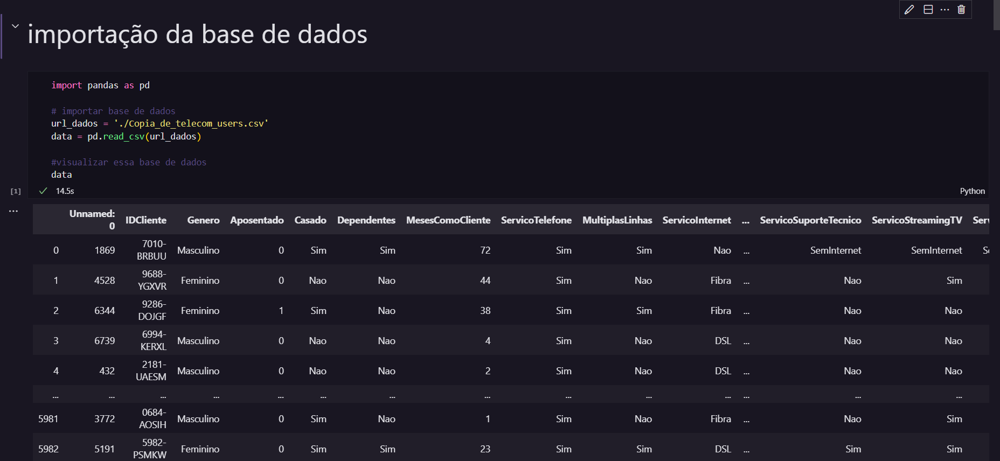
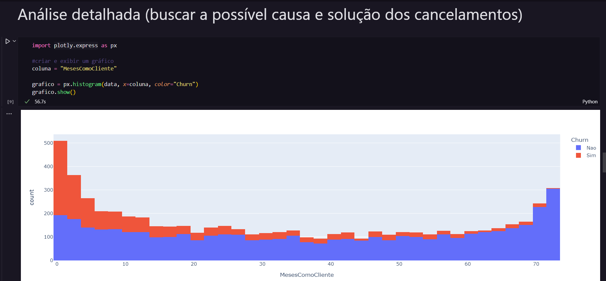

# Análise de dados
2º dia do intensivão de python, oferecido por [Hashtag Treinamentos](https://www.hashtagtreinamentos.com/?origemurl=75502579145&gclid=CjwKCAjwp7eUBhBeEiwAZbHwkWCgZZLkOP6JTEeM83hiRjuT0eEvzyvQ5nKsIGJNGIDe8yO-M7bjMxoCtocQAvD_BwE), que aconteceu entre os dias 07/03/2022 e 10/03/2022

## Foi utilizado
*   [Pandas](https://pandas.pydata.org/docs/)
*   [Plotly](https://plotly.com/python/)

## Prints

 
 

 
 

## Aulas apresentadas por :

| [ LIRA](https://www.linkedin.com/in/jo%C3%A3o-paulo-rodrigues-de-lira-50664758/) |
| :---: |

### MIT License